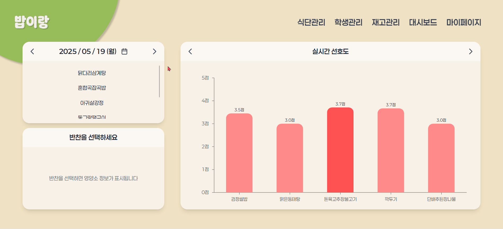
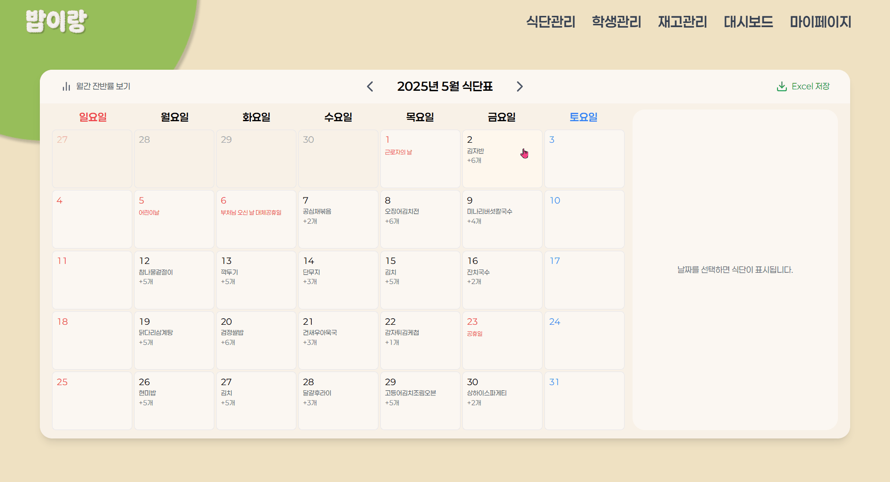
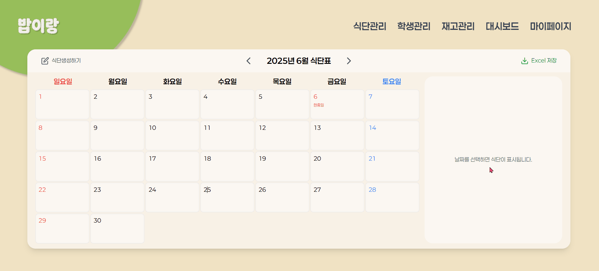
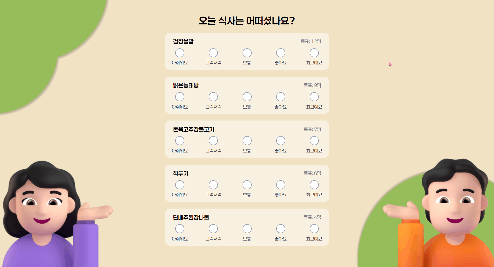
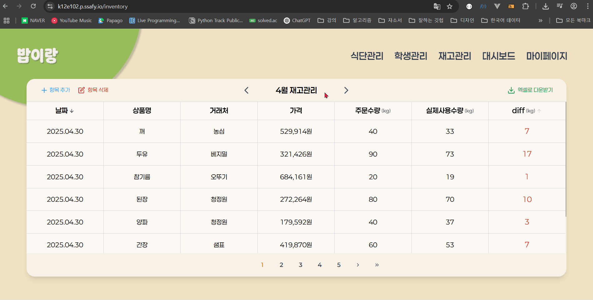
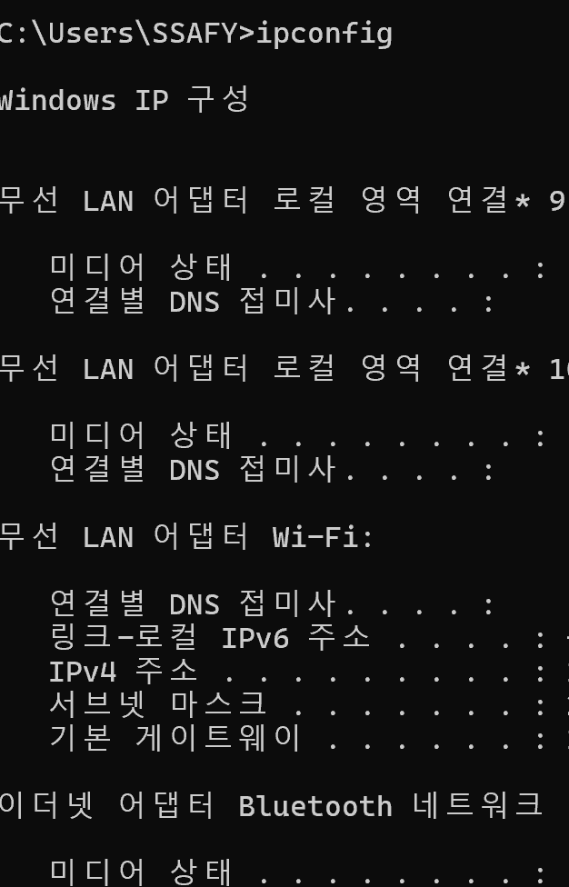
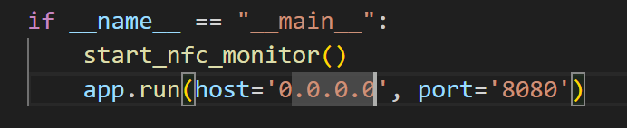

# 📚포팅 메뉴얼

## 📑목차

### [1. 기술 스택 & 버전 정보](#기술-스택-버전-정보)

### [2. 빌드 방법](#빌드-방법)

### [3. 환경 변수](#환경-변수)

### [4. 외부 서비스 정보](#외부-서비스-정보)

### [5. 기타 설정](#기타-설정)

---


## 홈페이지 시연 모습



<br>



<br>


 
<br>



<br>


<br>



## 🛠기술 스택 & 버전 정보

### 1. 프로젝트 협업 툴

| 구분         | 도구명                      |
| ------------ | --------------------------- |
| 이슈 관리    | JIRA                        |
| 형상 관리    | GitLab                      |
| 커뮤니케이션 | Notion, Mattermost, Discord |
| 설계         | ERDCloud                    |
| 디자인       | Figma                       |

</br>

### 2. 개발환경

#### IDE

| 도구명   | 버전       |
| -------- | ---------- |
| VS Code  | 1.97.1     |
| IntelliJ | 2024.3.4.1 |

#### DB

| DB 종류 | 버전   |
| ------- | ------ |
| MySQL   | 8.0.41 |

#### CI/CD

| 도구명  | 버전    |
| ------- | ------- |
| Jenkins | 2.492.1 |
| Docker  | 27.5.1  |

</br>

### 3. 상세

#### Backend

##### Spring Boot

| 항목              | 내용                                   |
| ----------------- | -------------------------------------- |
| Language          | Java 17                                |
| Build Tool        | Gradle                                 |
| Spring Boot       | 3.4.3                                  |
| Dependency Plugin | io.spring.dependency-management: 1.1.7 |

---

| 분야        | 라이브러리 / 기술            | 버전           | 비고                        |
| ----------- | ---------------------------- | -------------- | --------------------------- |
| ORM         | Spring Data JPA              | -              | -                           |
| API 문서    | SpringDoc OpenAPI            | 2.8.3          | Swagger UI                  |
| 인증 / 보안 | Spring Security              | -              | -                           |
| JWT         | java-jwt / jjwt              | 4.2.1 / 0.11.5 | Access / Refresh Token 처리 |
| Web / REST  | Spring Web                   | -              | REST API                    |
| SSE         | SseEmitter (Spring Web 내장) | -              | 단방향 실시간 푸시          |
| JSON        | Jackson Datatype JSR310      | -              | LocalDate 등 처리           |
| DB Driver   | MySQL Connector              | -              | -                           |
| 테스트      | Spring Boot Test / JUnit 5   | -              | JUnit Platform 포함         |

##### FastApi

##### python 버전 3.10.x

| 라이브러리             | 버전      | 비고                        |
| ---------------------- | --------- | --------------------------- |
| fastapi                | >=0.110   | 메인 백엔드 프레임워크      |
| uvicorn                | >=0.29    | ASGI 서버                   |
| pydantic               | 2.10.6    | 데이터 검증 및 직렬화       |
| python-dotenv          | 1.0.0     | 환경변수 로딩               |
| torch                  | >=2.1     | 딥러닝 프레임워크           |
| torchvision            | >=0.16    | 컴퓨터 비전 모델            |
| timm                   | >=0.9.12  | MiDaS 모델                  |
| opencv-python-headless | >=4.8     | 이미지/영상 처리 (Docker용) |
| Pillow                 | >=10.0.0  | 이미지 처리 (PIL)           |
| numpy                  | >=1.24    | 수치 계산                   |
| pandas                 | >=2.0     | 데이터 분석                 |
| matplotlib             | >=3.7.0   | 시각화                      |
| onnxruntime            | >=1.14.0  | ONNX 모델 추론              |
| onnx                   | >=1.14.1  | 모델 변환                   |
| boto3                  | >=1.34.0  | AWS S3 연동                 |
| aiobotocore            | >=2.7     | 비동기 S3 접근              |
| ultralytics            | >=8.0.166 | YOLOv8 객체 탐지            |
| langchain              | >=0.0.268 | LLM 프레임워크              |
| langchain-community    | >=0.0.20  | LLM 커뮤니티 컴포넌트       |
| langgraph              | >=0.1.0   | LLM 워크플로우              |
| langchain-openai       | >=0.0.8   | OpenAI 연동                 |
| openai                 | >=0.27.6  | OpenAI API 호출             |
| requests               | >=2.31    | HTTP 요청                   |
| aiohttp                | >=3.8.0   | 비동기 HTTP                 |
| pyyaml                 | >=6.0     | YAML 파싱                   |
| loguru                 | >=0.6.0   | 로깅                        |

#### Frontend

##### React

##### node 버전 20.18.x

| 라이브러리                   | 버전      | 비고                  |
| ---------------------------- | --------- | --------------------- |
| react                        | ^19.0.0   | React 핵심            |
| react-dom                    | ^19.0.0   | DOM 렌더링            |
| react-router-dom             | ^7.5.2    | 라우팅                |
| axios                        | ^1.9.0    | HTTP 통신             |
| zustand                      | ^5.0.3    | 상태 관리             |
| chart.js                     | ^4.4.9    | 차트 시각화           |
| recharts                     | ^2.15.3   | 반응형 차트           |
| react-calendar               | ^5.1.0    | 캘린더 컴포넌트       |
| react-icons                  | ^5.5.0    | 아이콘 모음           |
| event-source-polyfill        | ^1.0.31   | SSE 지원              |
| file-saver                   | ^2.0.5    | 파일 다운로드         |
| html2canvas                  | ^1.4.1    | HTML 캡처             |
| jspdf                        | ^3.0.1    | PDF 생성              |
| react-to-print               | ^3.1.0    | 프린트 기능           |
| styled-reset                 | ^4.5.2    | CSS 리셋              |
| sweetalert2                  | ^11.21.0  | 알림 모달             |
| xlsx                         | ^0.18.5   | Excel 파일 처리       |
| typescript                   | ~5.7.2    | 타입스크립트          |
| vite                         | ^6.3.1    | 빌드 도구             |
| tailwindcss                  | ^3.4.1    | CSS 프레임워크        |
| @types/react                 | ^19.0.10  | React 타입 정의       |
| @types/react-dom             | ^19.0.4   | React DOM 타입 정의   |
| @types/node                  | ^22.15.14 | Node.js 타입 정의     |
| @types/file-saver            | ^2.0.7    | FileSaver 타입 정의   |
| @types/event-source-polyfill | ^1.0.5    | EventSource 타입 정의 |
| @vitejs/plugin-react         | ^4.3.4    | Vite React 플러그인   |
| eslint                       | ^9.22.0   | 코드 린터             |
| postcss                      | ^8.5.3    | CSS 전처리기          |
| autoprefixer                 | ^10.4.21  | CSS 접두사 자동화     |

#### IoT

##### Flask

##### python 버전 3.9.x

| 라이브러리    | 버전    | 비고                         |
| ------------- | ------- | ---------------------------- |
| Flask         | ^2.0.0  | 웹 프레임워크                |
| opencv-python | ^4.8.0  | 이미지 처리 및 카메라 스트림 |
| boto3         | ^1.34.0 | AWS S3 연동                  |
| python-dotenv | ^1.0.0  | 환경변수 로딩                |
| pyscard       | ^2.0.7  | NFC 카드 리더 통신           |
| smartcard     | ^2.0.3  | 스마트카드 통신 프레임워크   |
| requests      | ^2.31.0 | HTTP 요청 처리               |

#### Server

| 환경  | 버전           |
| ----- | -------------- |
| AWS   | 6.8.0-1021-aws |
| Nginx | 1.18.0         |

</br>

---

## ⚙빌드 방법

### ✅ Spring Boot

1. `backend/baperang` 프로젝트 열기
2. JDK 17 버전 설치 및 설정 확인
3. `./gradlew clean build` 명령어로 빌드 수행
4. 빌드 성공 시, `build/libs` 디렉토리 내 `.jar` 파일 실행
   ```
   java -jar build/libs/pictory-0.0.1-SNAPSHOT.jar
   ```
5. 실행 후 http://localhost:8000 으로 접속 확인

</br>

### ✅ FastAPI

1. `ai/` 디렉토리로 이동
2. Python 3.10+ 가상환경 생성 및 활성화
   ```
   python -m venv venv
   # Windows
   venv\Scripts\activate
   # Linux/Mac
   source venv/bin/activate
   ```
3. 의존성 설치
   ```
   pip install -r requirements.txt
   ```
4. .env 파일 설정
   ```
   OPENAI_API_KEY=your_api_key
   DEBUG=True
   LLM_MODEL=gpt-4
   LLM_TEMPERATURE=0.2
   ```
5. 서버 실행

   ```
   # 직접 모듈 실행
   python -m app.main

   # 또는 uvicorn 사용
   uvicorn app.main:app --host 0.0.0.0 --port 8001 --reload
   ```

</br>

### ✅ React

1. `frontend/` 디렉토리로 이동
2. 패키지 설치
   ```
   npm install
   ```
3. 개발 서버 실행
   ```
   npm run dev
   ```

</br>

### ✅ Flask

1. `hardware/` 디렉토리로 이동
2. 개발 서버 실행
   

   - cmd창에서 ipconfig 입력 후 무선 LAN 어댑터 Wi-Fi의 IPv4 주소 확인

   

   - host=0.0.0.0 부분에 해당 ip 주소 입력

   ```
   python app.py
   ```

   - 윈도우 창에 해당ip주소:8080 입력후 app.py 파일 실행

---

## 🌞설정 파일

### Spring Boot

#### application-secret.yml

        spring.application.name=baperang

        server.port=8000

        management.server.port=9000

    # MySQL Database Configuration
        spring.datasource.url=${SPRING_DATASOURCE_URL}
        spring.datasource.username=${SPRING_DATASOURCE_USERNAME}
        spring.datasource.password=${SPRING_DATASOURCE_PASSWORD}
        spring.datasource.driver-class-name=com.mysql.cj.jdbc.Driver

    # Hibernate Configuration
        spring.jpa.hibernate.ddl-auto=update
        spring.jpa.properties.hibernate.dialect=org.hibernate.dialect.MySQLDialect
        spring.jpa.show-sql=true

    # SQL
        spring.sql.init.mode=never
        # spring.sql.init.schema-locations=classpath:ddl.sql
        spring.sql.init.continue-on-error=true

    # JWT Configuration
        JWT_SECRET=${JWT_SECRET}
        jwt.access-token-validity-in-seconds=${JWT_ACCESS_TOKEN_VALIDITY_IN_SECONDS}
        jwt.refresh-token-validity-in-seconds=${JWT_REFRESH_TOKEN_VALIDITY_IN_SECONDS}

#### Dockerfile

    ```
    # ─────────────────────────────────────
    # 1) Build stage: JDK17 + Gradle
    # ─────────────────────────────────────
    FROM gradle:7.6-jdk17 AS builder
    WORKDIR /app

    # Gradle Wrapper, 설정파일 복사 (캐시 활용)
    COPY gradle gradle
    COPY gradlew .
    COPY build.gradle settings.gradle ./

    # 소스 복사 & 빌드
    COPY src src
    RUN chmod +x gradlew && ./gradlew clean bootJar -x test

    # ─────────────────────────────────────
    # 2) Run stage: JRE만 포함
    # ─────────────────────────────────────
    FROM openjdk:17-jdk-slim
    WORKDIR /app

    # builder에서 만든 JAR 복사
    COPY --from=builder /app/build/libs/*.jar app.jar

    # 컨테이너 내부 포트
    EXPOSE 8000

    # 앱 실행
    ENTRYPOINT ["java","-jar","app.jar"]
    ```

### FastAPI

#### Dockerfile

    ```
    # 1) Python 베이스 이미지
    FROM python:3.10.11-slim

    # 2) 작업 디렉토리
    WORKDIR /app

    # OpenCV가 필요로 하는 시스템 라이브러리
    RUN apt-get update && apt-get install -y \
        libglib2.0-0 \
        libsm6 \
        libxext6 \
        libxrender1 \
        libgl1 \
    && rm -rf /var/lib/apt/lists/*

    # 3) 의존성 복사 및 설치 (context: ai/)
    COPY requirements.txt .
    RUN pip install --no-cache-dir -r requirements.txt

    # 4) 실제 애플리케이션 복사 (context: ai/app → 컨테이너 /app/)
    COPY app/ ./app

    # 5) 모델 캐시 디렉토리 생성
    RUN mkdir -p /app/model_cache

    # 6) MiDaS 모델 미리 다운로드
    RUN python -c "import torch; torch.hub.load('intel-isl/MiDaS', 'DPT_Large', trust_repo=True)"


    # 7) 엔트리포인트 설정
    EXPOSE 8001
    CMD ["uvicorn", "app.main:app", "--host", "0.0.0.0", "--port", "8001"]
    ```

## 💻외부 서비스 정보

#### OpenApi

> 스토리 생성을 포함한 각종 AI 기능을 위해 필요

## DB 정보

#### DB 기본 데이터 삽입

> exec 폴더안의 db 폴더안의 db매뉴얼을 참고하여 기본적인 데이터를 넣을 수 있다.
